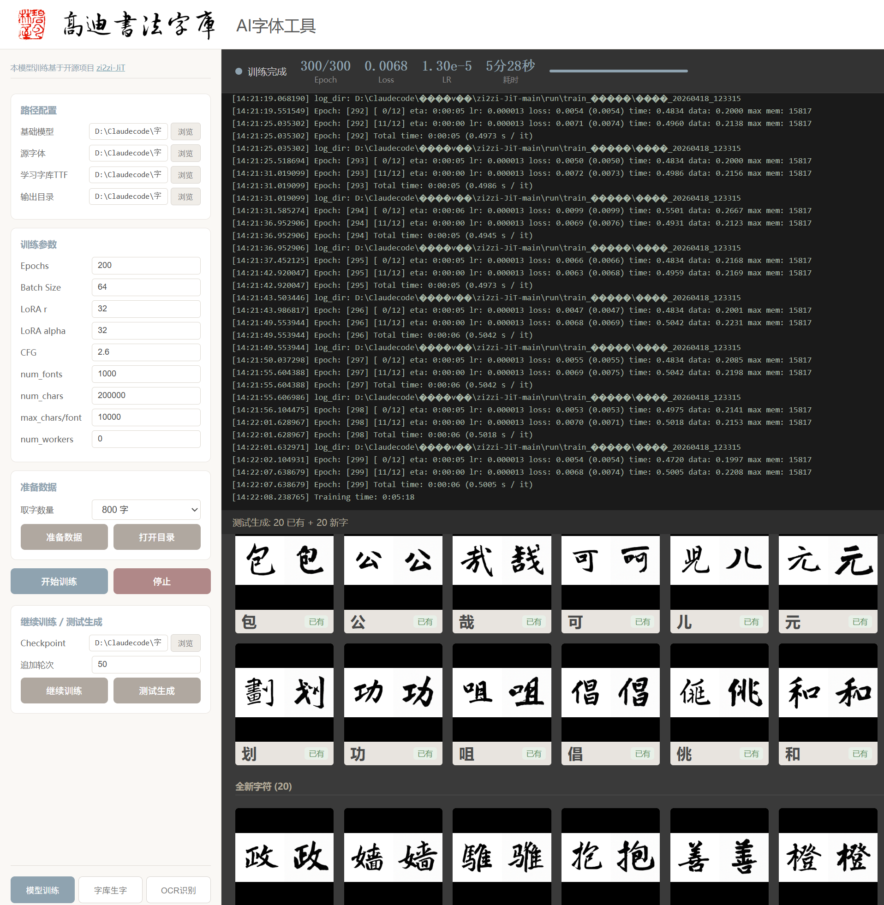
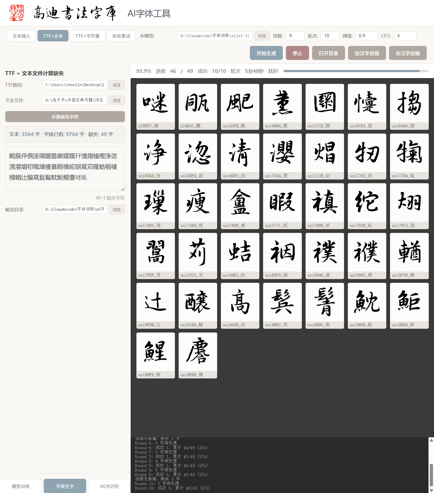
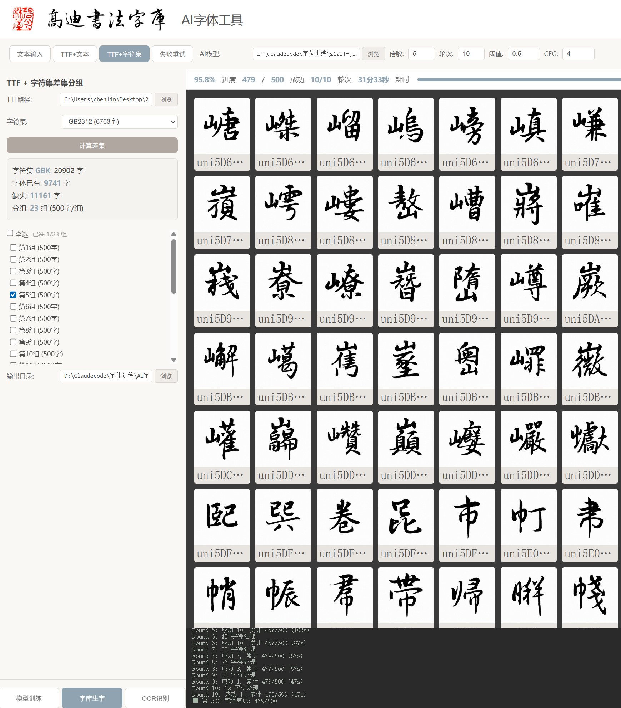
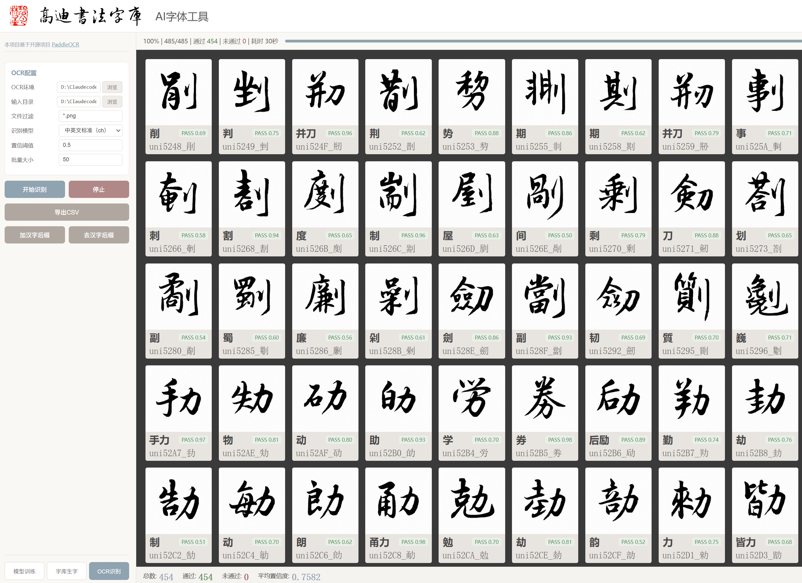

# AI 字体生产工具

基于 [zi2zi-JiT](https://github.com/kaonashi-tyc/zi2zi-JiT) 的 AI 字体训练、字库生字、OCR 验证 Web 应用。通过 LoRA 微调学习手写字体风格，批量生成高质量书法字体图片，图片命名遵循 FontLab / FontForge 格式，批量导入即可成字。

本项目配合**高迪书法字库预处理工具**使用，也可独立运行。

## 功能概览

### 页面一：模型训练

根据已有手写字库，训练出 LoRA 微调模型（.pth）。支持多轮次迭代训练，训练完成后可一键生成测试字符预览效果。



### 页面二：字库生字（核心功能）

根据训练好的模型和需要的字符，生成书法字体图片。这是本项目的核心功能。

**四种输入方式：**
- **文本粘贴** — 直接粘贴需要生成的汉字
- **TTF + 文本** — 上传 TTF 和 txt/docx/pdf/epub/mobi 文件，自动计算字体缺失的字符
- **TTF + 字符集** — 与 GB2312/GBK/Big5 字符集计算差集，按 500 字一组，勾选组别后逐组生成
- **失败重试** — 粘贴迭代失败的字符重试

**质量保障机制：** 每个字符一次生成 5 倍图片，经 OCR 识别后按置信度优选，再进行多轮迭代直到全部通过。质量远高于单次直接生成。

**输出规范：** 图片命名遵循 FontLab / FontForge 格式（`uni4E00_一.png`），批量导入字体编辑软件即可成字。




### 页面三：OCR 识别验证

对生成的字体图片进行批量 OCR 识别和置信度评分，方便筛选和删除不合格的结果。支持添加/去除汉字后缀，配合 FontLab 工作流。

> OCR 基于开源项目 [PaddleOCR](https://github.com/PaddlePaddle/PaddleOCR)。需注意：PaddleOCR 对生僻字、繁体字的识别率较低，而 AI 生字的核心场景恰恰是生产生僻字（常用字需要自己手写才有风格和意义），因此 OCR 验证主要起辅助筛选作用。



## 技术栈

| 组件 | 技术 |
|------|------|
| 后端 | Python 3 + Flask |
| AI 引擎 | [zi2zi-JiT](https://github.com/kaonashi-tyc/zi2zi-JiT)（PyTorch + LoRA 微调） |
| OCR | [PaddleOCR](https://github.com/PaddlePaddle/PaddleOCR) |
| 前端 | 原生 HTML / CSS / JavaScript |
| 字体处理 | fontTools + Pillow |

## 快速开始

### 环境要求

- Python 3.10+
- CUDA 环境（训练和推理需要 GPU）
- zi2zi-JiT 环境（独立 conda/venv）
- PaddleOCR 环境（独立 venv）

### 安装

```bash
pip install -r requirements.txt
```

### 配置

复制 `config.py` 中的默认路径，或通过环境变量覆盖：

```bash
export ZI2ZI_DIR=/path/to/zi2zi-JiT
export ZI2ZI_PYTHON=/path/to/zi2zi-env/python
export OCR_PYTHON=/path/to/paddle-env/python
```

### 启动

```bash
python app.py
```

访问 `http://localhost:7550`

## 项目结构

```
AI字体生产/
├── app.py                    # Flask 主应用
├── config.py                 # 配置（路径、参数、字符集）
├── static/
│   ├── css/style.css         # 莫兰迪色系样式
│   └── js/
│       ├── common.js         # 公共函数
│       ├── train.js          # 训练页逻辑
│       ├── generate.js       # 生字页逻辑
│       └── ocr.js            # OCR 页逻辑
├── templates/
│   ├── base.html             # 基础模板
│   ├── train.html            # 训练页
│   ├── generate.html         # 生字页
│   └── ocr.html              # OCR 页
└── utils/
    ├── train_manager.py      # 训练进程管理
    ├── generate_manager.py   # 迭代生成管理
    ├── ocr_manager.py        # OCR 进程管理
    └── charset_utils.py      # 字符集工具（GB2312/GBK/Big5 + CJK 扩展区）
```

## CJK 扩展区支持

完整支持 CJK Extension B-G（U+20000 - U+3134F）等扩展区汉字：
- Python 端统一使用 `is_cjk()` 函数判断，覆盖所有 CJK 区段
- JavaScript 端使用 `Array.from()` / 扩展运算符正确处理 surrogate pair
- 源字体不支持扩展区字符时，自动 fallback 到系统扩展区字体（simsunb.ttf）

## 许可证

本项目基于 zi2zi-JiT 开源项目开发，仅供学习和研究使用。

## 致谢

- [zi2zi-JiT](https://github.com/kaonashi-tyc/zi2zi-JiT) — AI 字体风格迁移模型
- [PaddleOCR](https://github.com/PaddlePaddle/PaddleOCR) — OCR 识别引擎
- [fontTools](https://github.com/fonttools/fonttools) — 字体文件解析
